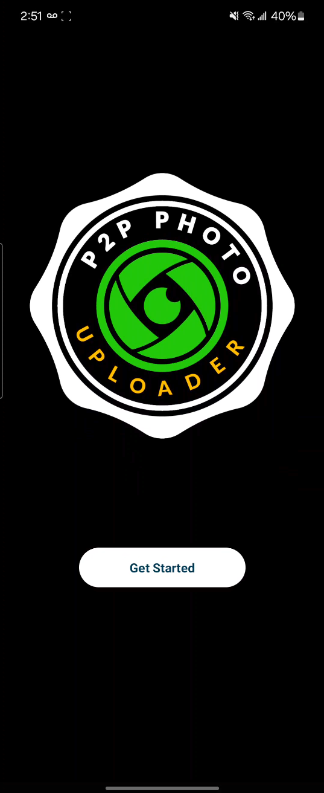
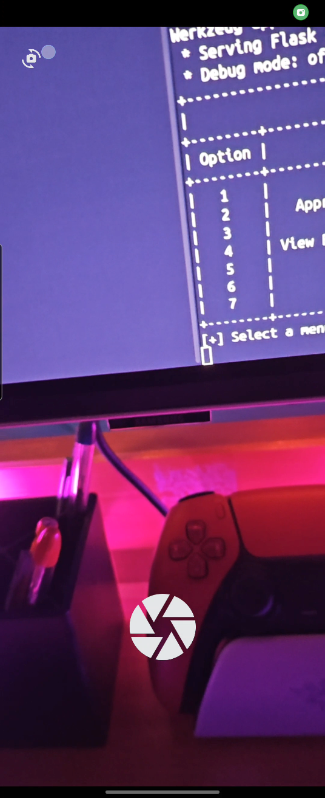
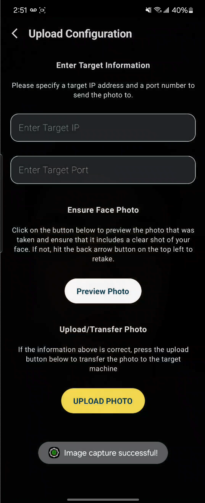

# P2P Photo Uploader Android App 

  
  
  

---

## Table of Contents
- [Overview](#overview)
- [Requirements](#requirements)
- [Installation](#installation)

## Overview
An Android application (developed in Kotlin) that specifically and securely uploads photos captured on an Android device to the [P2P Application here](https://github.com/johnny-hui/major_project).

## Requirements
Ensure you have the following requirements:
  - **Android Device with a Camera**
      - Minimum SDK: 28 (Android 9 - Pie)
      - Target SDK: 34 (Android 14 - Upside Down Cake)
        
## Installation
To install the Android camera app, perform the following steps:
  - 1) Download the APK file [here (Google Drive)](https://drive.google.com/file/d/1DJLwPun_fCXht6jTUslsY0G_5j74IOTu/view)
  - 2) With a USB cable, connect your Android device to your PC
  - 3) Unlock your device
  - 4) On your device, tap the "Charging this device via USB" notification.
  - 5) Under "Use USB for," select File Transfer. A file transfer window will open.
  - 6) Once opened, drag the APK file to the “downloads” directory
  - 7) On your Android device, go open the Files app and open the “appdebug.apk” file
  - 8) Enter OK on any warnings or prompts that may appear during installation of
     the APK file
  - 9) When launching the app for the first time, you’ll be prompted to grant
     camera permissions to the app; enter “while using this app”
